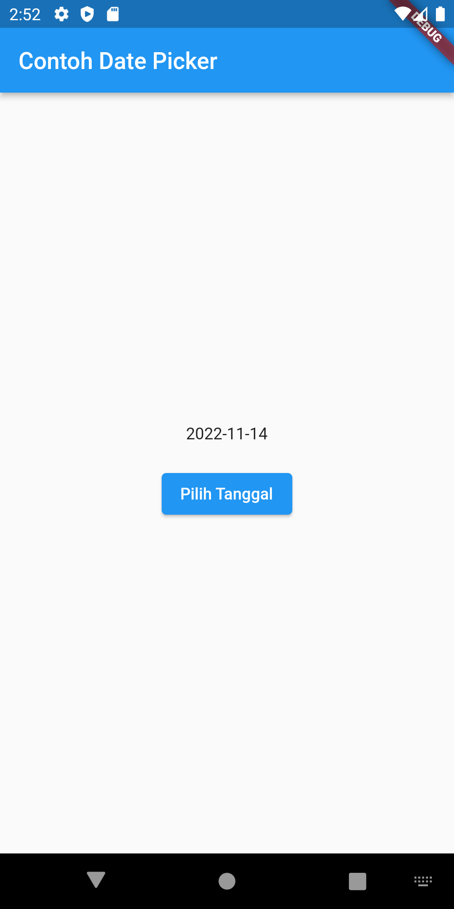

# basic_flutter_app

Muh. Fauzi Ramadhan Nugraha
TI - 3B
2041720022

Basic app for Flutter.
Berikut beberapa hasil praktikum yang berhasil saya kerjakan :

## Hasil Aplikasi

| Menu Page |
| ------------------ |
|   |

| Text Widget | Image Widget | iOS Cupertino |
| ------------------ | --------------------------- | ------------------ |
|   |  |  |

| Button | Scaffold | Dialog |
| ------------------ | ------------------ | ------------------ |
|   |   |   |

| Input & Select | Property Child | Grid View |
| ------------------ | ------------------ | ------------------ |
|   |   |  |

| Date & Time Picker |
| ------------------ |
|       

| Property Aligment | Property Color | Property Height & Weight |
| ------------------ | --------------------------- | ------------------ |
|   |  |  |

| Property Margin| Property Padding | Property Transform |
| ------------------ | --------------------------- | ------------------ |
|   |  |  |

| Property Decoration | Column Widget | Row Widget |
| ------------------ | --------------------------- | ------------------ |
|   |  |  |

| Stack | List View |
| ------------------ | ------------------ |
|   |     |

| Tugas Praktikum |
| ------------------ |
|   |

